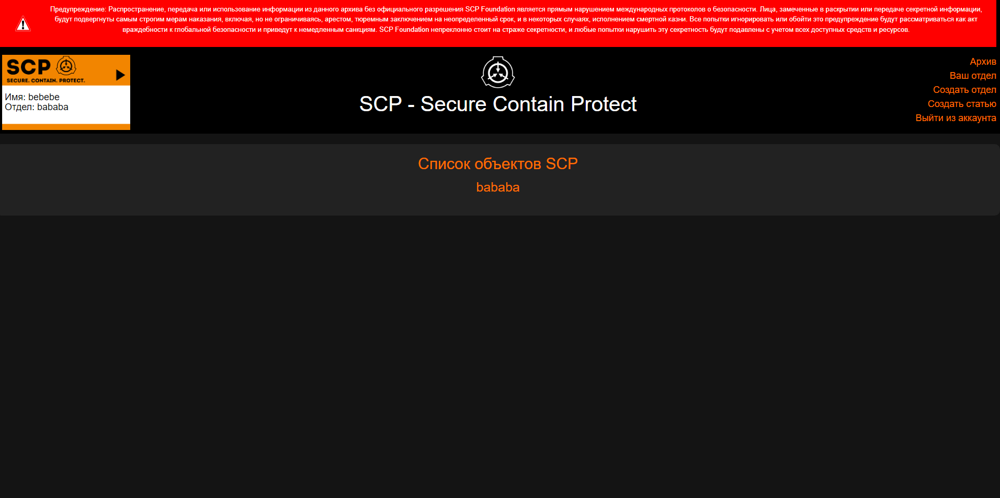

Сервис для записи статей про объекты с логический разделением на отделы. Было специально заложено 3 уязвимости для соревнований.
**[Описание уязвимостей](sploit/)**

Использованы технологии: Язык Golang, библиотека для написания веб приложений Gin, Для сборки проекта Docker.
